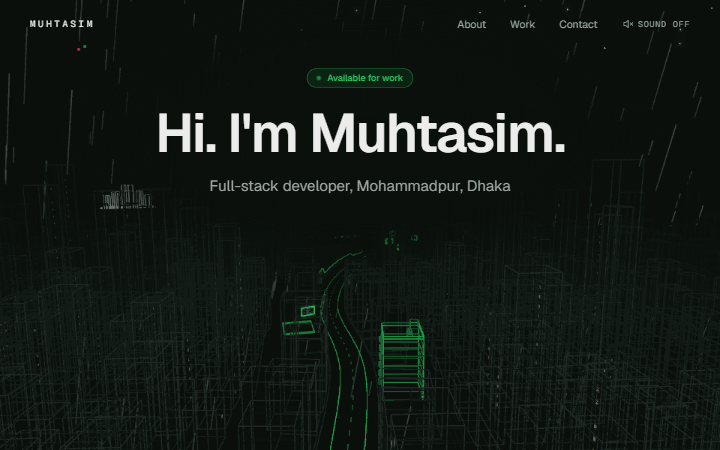

# Neon Dhaka

The portfolio of Mir MD Muhtasim Hasan, a full-stack developer in Mohammadpur, Dhaka. A scroll-driven camera flies through a neon wireframe Dhaka, from night to dawn.

**Live: [muhtasim-hasan.vercel.app](https://muhtasim-hasan.vercel.app)**



## What it does

You scroll, the camera moves. It never moves on its own, and scrolling back up plays everything in reverse. Each section is a stop on the road, with a hold long enough to read it.

1. **Hero:** night Dhaka from the sky, a dense skyline with a tiny Shaheed Minar on the horizon. "Hi. I'm Muhtasim."
2. **About, lockdown night:** the camera dives to street level in front of a Mohammadpur house. The city's windows switch off one by one until a single window is left: someone at a laptop, a ceiling fan turning. A code card types out how I started: HTML in lockdown, out of boredom.
3. **Credentials:** a building under construction, one lit floor per course or degree, with a Dhaka-style construction signboard. Status: still building.
4. **Tech stack:** a neon gate reads MY TECH STACK, then a street of shop signs for my tools in three zones: Frontend, Backend & Data, Deploy & DevOps. Click a sign and a red pulse runs along the overhead cable to the projects that use that tool.
5. **Projects:** a green highway gantry over the Hatirjheel bridge, then one billboard per project with a screenshot, stack and link.
6. **Contact:** the road ends at Sangsad Bhaban across the lake. A red sun rises behind it and the sky turns to dawn. You can drag to turn the building. The contact form sends straight to my inbox.

The colours are the Bangladesh flag, night to dawn: dark green, neon green, and one red that saves itself for the sunrise.

## Sangsad Bhaban

The National Parliament House at the end of the road is my own model, built in Blender from Louis Kahn's design and exported as `public/models/sangsad-bhaban.glb` (80 KB). The site draws its crease edges in green, fills its faces with the sky colour so hidden lines stay hidden, and slices it every 1.5 m for the marble bands.

## Phone version

Phones (touch devices, or any window narrower than 900 px) get a lighter version instead of the fly-through. The sections scroll normally over one dim, drifting skyline. There's a drawn house with the lit window, a building that rises floor by floor as you scroll, neon sign grids that flicker on, project cards, and the same Sangsad Bhaban model with the sun rising behind it. The canvases render at 30 fps at most, only when something changes.

Reduced motion is respected everywhere: on desktop the camera cuts between stops instead of flying, and on phones everything stays still.

## Tech stack

- [Next.js](https://nextjs.org) 16 (App Router), React 19, TypeScript, Tailwind CSS 4
- [three.js](https://threejs.org) with [React Three Fiber](https://r3f.docs.pmnd.rs), drei and postprocessing (selective bloom)
- [GSAP](https://gsap.com) ScrollTrigger and [Lenis](https://lenis.darkroom.engineering) for the scroll, [maath](https://github.com/pmndrs/maath) for frame-rate independent damping
- [Web3Forms](https://web3forms.com) for the contact form, [Vercel Web Analytics](https://vercel.com/analytics) for visits
- Deployed on [Vercel](https://vercel.com)

The whole city is generated in code from a fixed seed, so it's the same on every visit. Only Sangsad Bhaban is a model.

## Run it locally

You need Node.js 20.9 or newer.

```bash
git clone https://github.com/mirmuhtasimhasan-dev/my-portfolio.git
cd my-portfolio
npm install
```

The contact form needs a free [Web3Forms](https://web3forms.com) access key. Create `.env.local` in the project root:

```bash
NEXT_PUBLIC_WEB3FORMS_KEY=your-access-key
```

Without it the site still runs; the form just offers my email address instead of sending.

```bash
npm run dev     # http://localhost:3000
npm run build   # production build
npm run lint
```

Press **D** on desktop for a debug overlay with the scroll progress, current stop and frame rate.

## Project structure

```
app/                  Pages, layout, metadata, share image
  projects/           The "All projects" page
components/
  scene/              The 3D city: camera rig, city, signs, bridge, landmarks
  phone/              The phone version
  *.tsx               Text overlays, nav, contact form, cursor, smooth scroll
lib/                  Camera path, stop map, timelines, city and sign layout
data/                 Projects and tools (edit these to update the content)
public/
  models/             sangsad-bhaban.glb
  projects/           Project screenshots
  fonts/              Geist Mono for the 3D text
docs/
  SPEC.md             The full build spec
  preview.gif         The preview above
```

To add a project or a tool, edit `data/projects.ts` or `data/tools.ts`. The billboards, bridge length and sign layout follow from the data.

## Credits

- Tool logos from [Simple Icons](https://simpleicons.org) (CC0)
- Contact form by [Web3Forms](https://web3forms.com)
- [Geist and Geist Mono](https://vercel.com/font) fonts by Vercel (SIL Open Font License)
- Sangsad Bhaban designed by Louis I. Kahn; the 3D model is my own

## License

The code is under the [MIT License](LICENSE). The Sangsad Bhaban model, project screenshots and written content are mine; please ask before reusing them.
